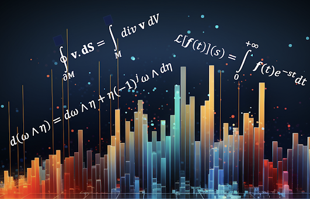

Exploration and analysis of data on manifold
Patrick Nicolas - Oct 2023 - Oct 2024

## References
[Post: Geometric Learning in Python: Basics](https://patricknicolas.blogspot.com/2024/03/geometric-learning-in-python-manifolds.html)     
[Post: Geometric Learning in Python: Manifolds](https://patricknicolas.blogspot.com/2024/03/geometric-learning-in-python-manifolds.html)    
[Post: Geometric Learning in Python: Differential Operators](https://patricknicolas.blogspot.com/2023/12/explore-differential-operators-in-python.html)     
[Post: Geometric Learning in Python: Intrinsic Representation](https://patricknicolas.blogspot.com/2024/03/geometric-learning-in-python-coordinates.html)     

[Newsletter: Geometric Learning in Python](https://www.linkedin.com/newsletters/geometric-learning-in-python-7175924072638263296/)     

## Environment
| Library       | Version |
|:--------------|:--------|
| Python        | 3.10.10 |
| SymPy         | 1.12    |
| Numpy         | 1.26.3  |
| Pydantic      | 2.4.1   |
| Shap          | 0.43.0  |
| Torch         | 2.1.1   |
| Scikit-learn  | 1.3.2   |
| Geomstats     | 2.7.0   |

## Packages
**manifolds** Differential geometry concepts such as Geodesics, Vector fields, Tangent space, exponential and     
              Logarithm maps, contravariant and covariant vector fields...  
- _BinaryLRManifold_    Evaluation of Geomstats functions related to the binary logistic regression 
on a manifold as the group of Symmetric Positive Definite (SPD) matrices.
- _KMeansOnManifold_ Evaluation of k-means algorithm on Euclidean space using Scikit-learn library and
on the hypersphere (as Riemann manifold) using Geomstats library.
The evaluation relies on synthetic clustered data on hypersphere.
- _HypersphereSpace_ Definition of the Hypersphere geometric space as a 2D manifold in a 3D Euclidean space.
    The key functions are:
    1) Select uniform data point on the hypersphere
    2) Define a tangent vector from a vector in Euclidean space and a
                     location on the hypersphere
    3) Display the hypersphere and related components in 3D
- _FunctionSpace_     Class wrapper for the Function space using the Hilbert Sphere. The constructor generates the
    sample for the domain associated with the functions. The Hilbert domain is defined as [0, 1].
    This class inherit the Hilbert Sphere defined in the Geomstats module.
- _RiemannianConnection_ Creation a formal Riemann connection with associated metric from a Manifold or Level set.
    The metric is automatically selected from the type of manifold. This class is a wrapper of 
    the Connection, Manifold and RiemannianMetric classes in Geomstats library.
    Initialization sequence:   Manifold (space) => Metric => Connection.
- _HyperspherePCA_ Definition of principal components analysis on a tangent space of a hypersphere.
- _EuclideanSpace_ Implementation of basic random sampling and visualization methods on Euclidean space.

**stats** Basic functions related to the Markov Chain Monte Carlo algorithms
- _metropolis_hastings_ Implementation of Metropolis Hastings algorithm.
- - _SHAPEval_ Evaluation of the various SHAP diagrams such as Decision, Summary, Force and Dependency plots.

**diffgeometry**  Differential operators, Gradient, Divergence, Curl and transforms such as Laplace and Fourier     
                  using SymPy Python library  
        
**informationgeometry** Riemann geometry, probabilistic concepts such as Fisher Information Matrix

**stats** Statistics for validation      
     
**util**  Utilities for HTTP server, Logging, I/O, Plotting...  
     

## Differential Geometry Concepts

### Challenges 

**Deep learning**    
Data scientists face challenges when building deep learning models that can be addressed by differential geometry. Those challenges are:     
**High dimensionality**: Models related to computer vision or images deal with high-dimensional data, such as images or videos, which can make training more difficult due to the _curse of dimensionality_.    
     
**Availability of quality data**: The quality and quantity of training data affect the model's _ability to generate realistic samples_. Insufficient or biased data can lead to over-fitting or poor generalization.       
    
**Under-fitting or over-fitting**: Balancing the model's ability to generalize well while avoiding over-fitting to the training data is a critical challenge. Models that overfit may generate high-quality outputs that are too like the training data, lacking novelty.     
     
**Embedding physics law or geometric constraints**: Incorporating domain constraints such as boundary conditions or differential equations models very challenging for high-dimensional data.     
     
**Representation dependence**: The performance of many learning algorithms is very _sensitive to the choice of representation_ (i.e. z-normalization impact on predictors).      

**Generative modeling**
Generative modeling includes techniques such as auto-encoders, generative adversarial networks (GANs), Markov chains, transformers, and their various derivatives.
Creating generative models presents several specific challenges beyond plain vanilla deep learning models for data scientists and engineers, primarily due to the complexity of modeling and generating data that accurately reflects real-world distributions. The challenges that can be addressed with differential geometry include:    

**Performance evaluation**: Unlike supervised learning models, assessing the performance of generative models is not straightforward. _Traditional metrics like accuracy do not apply_, leading to the development of alternative metrics such as the **Frechet Inception Distance** (FID) or Inception Score, which have their limitations.     
    
**Latent space interpretability**: Understanding and interpreting the latent space of generative models, where the model learns a _compressed representation of the data, can be challenging_ but is crucial for controlling and improving the generation process.    

### What is differential geometry?
Differential geometry is a branch of mathematics that uses techniques from calculus, algebra and topology to study the properties of curves, surfaces, and higher-dimensional objects in space. It focuses on concepts such as curvature, angles, and distances, examining how these properties vary as one moves along different paths on a geometric object.    
Differential geometry is crucial in understanding the shapes and structures of objects that can be continuously altered, and it has applications in many fields including physics (I.e., general relativity and quantum mechanics), engineering, computer science, and data exploration and analysis.     
    
Moreover, it is important to differentiate between differential topology and differential geometry, as both disciplines examine the characteristics of differentiable (or smooth) manifolds but aim for different goals. Differential topology is concerned with the overarching structure or global aspects of a manifold, whereas differential geometry investigates the manifold's local and differential attributes, including aspects like connection and metric.       
In summary differential geometry provides data scientists with a mathematical framework facilitates the creation of models that are accurate and complex by leveraging geometric and topological insights.    

### Application of differential geometry
#### Why differential geometry    
The following highlights the advantages of utilizing differential geometry to tackle the difficulties encountered by researchers in the creation and validation of generative models.    
**Understanding data manifolds**: Data in high-dimensional spaces often lie on lower-dimensional manifolds. Differential geometry provides tools to understand the shape and structure of these manifolds, enabling generative models to learn more efficient and accurate representations of data.      
     
**Improving latent space interpolation**: In generative models, navigating the latent space smoothly is crucial for generating realistic samples. Differential geometry offers methods to interpolate more effectively within these spaces, ensuring smoother transitions and better quality of generated samples.    
    
**Optimization on manifolds**: The optimization processes used in training generative models can be enhanced by applying differential geometric concepts. This includes optimizing parameters directly on the manifold structure of the data or model, potentially leading to faster convergence and better local minima.   
    
**Geometric regularization**: Incorporating geometric priors or constraints based on differential geometry can help in regularizing the model, guiding the learning process towards more realistic or physically plausible solutions, and avoiding over-fitting.      
    
**Advanced sampling techniques**: Differential geometry provides sophisticated techniques for sampling from complex distributions (important for both training and generating new data points), improving upon traditional methods by considering the underlying geometric properties of the data space.    
    
**Enhanced model interpretability**: By leveraging the geometric structure of the data and model, differential geometry can offer new insights into how generative models work and how their outputs relate to the input data, potentially improving interpretability.   
     
**Physics-Informed Neural Networks**:  Projecting physics law and boundary conditions such as set of partial differential equations on a surface manifold improves the optimization of deep learning models.   
     
**Innovative architectures**: Insights from differential geometry can lead to the development of novel neural network architectures that are inherently more suited to capturing the complexities of data manifolds, leading to more powerful and efficient generative models. 

### Python libraries for differential geometry
There are numerous open-source Python libraries available, with a variety of focuses not exclusively tied to machine learning or generative modeling, among them:   
    
**LaPy**: Specializes in the estimation of Laplace and Heat equations, as well as the computation of differential operators like gradients and divergence. More information can be found at  https://helmholtz.software/software/lapy   
    
**diffgeom**: A PyPi project aimed at symbolic differential geometry. Detailed information is available at  https://pypi.org/project/diffgeom/#description    
     
**SymPy**: A more comprehensive library for symbolic mathematics, useful for studying topology and differential geometry. Documentation is available at the following  https://docs.sympy.org/latest/modules/diffgeom.html    
    
**Geomstats**: Designed for performing computations and statistical analysis on nonlinear (Riemannian) manifolds. Visit https://geomstats.github.io/ for more details.     
    
**DFormPy**: A PyPi project focused on visualization and differential forms is available at https://pypi.org/project/dformpy/

**PyG**: PyTorch Geometric is a library built on PyTorch dedicated to geometric deep learning and graph neural networks https://pytorch-geometric.readthedocs.io/en/latest/

**PyRiemann**: A package based on scikit-learn provides a high-level interface for processing and classification of multivariate data through the Riemannian geometry of symmetric positive definite matrices https://pyriemann.readthedocs.io/en/latest/

**PyManOpt**: A library for optimization and automatic differentiation on Riemannian manifolds https://pymanopt.org/

