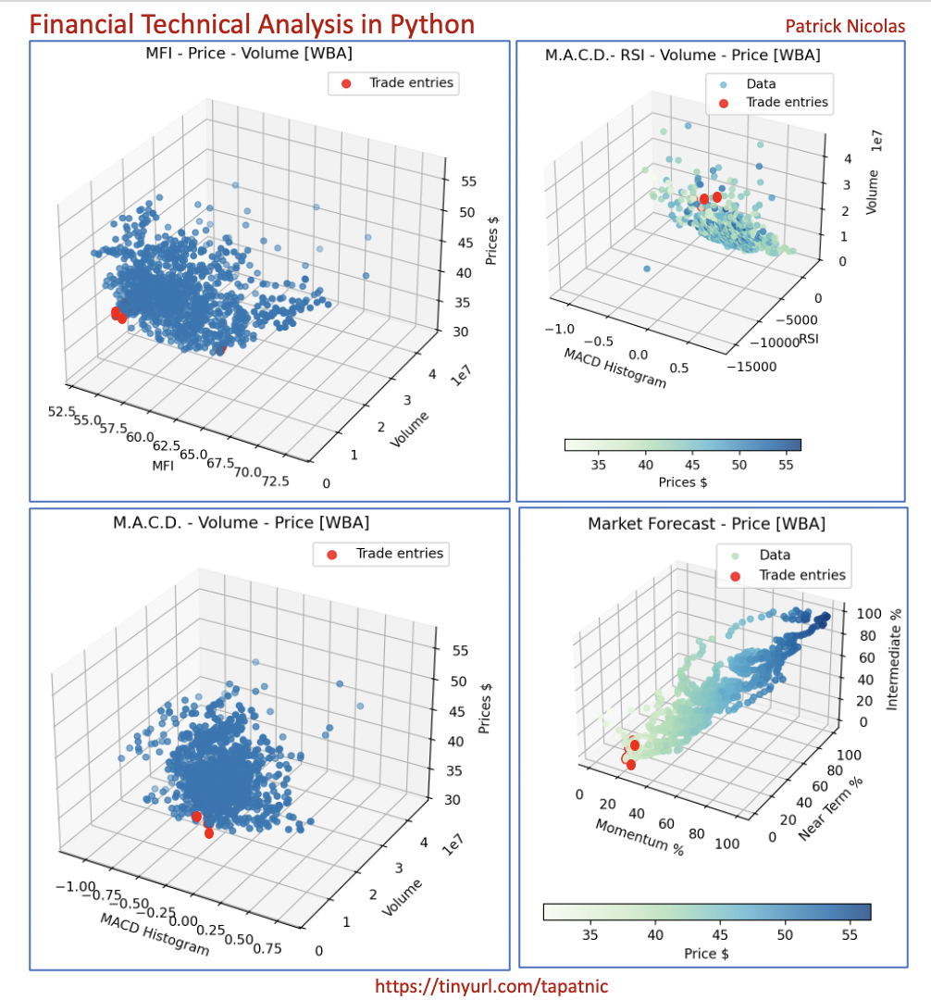

Example of Technical Analysis studies using Python and Numpy.   
Patrick Nicolas - Sep 2024

List of technical analysis studies:    
- Money flow index (__Mfi__)       
- Money flow index with price and volume   (__MfiVolPrice__)     
- Relative strength index (__Rsi__)    
- Moving Average Convergence/Divergence  (__Macd__)       
- Moving Average Convergence/Divergence with relative strength and volume (__MacdRsiVol__)      
- Moving Average Convergence/Divergence with volume and price (__MacdVolPrice__)      
- Market Forecast with price (__MarketForecast__)    
- Simple Moving Average    
- Exponential Moving Average    

